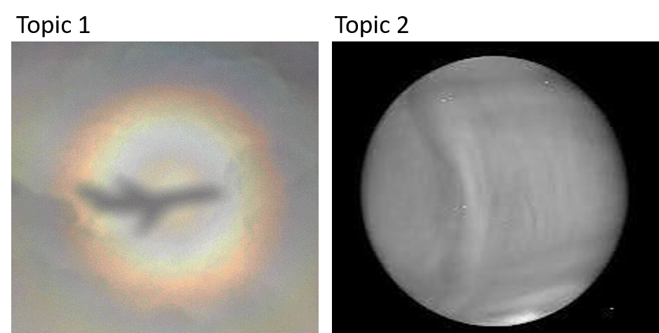

### 2024 Summer Intership at the Planetary Atmospheres Group (PAG) in the Institute of Basic Science (IBS) in Daejeon.
We welcome students to explore planeatry atmospheric research activities with PAG's members. Undergraduate and graduate school students can apply for the internship project. The initial internship duration is two months during the summer vacation(July and August), and is extendable for up to one year if the project progresses well. For successful candidates, start and end dates can be discussed later. The location of working is PAG/IBS, Daejeon, and possible remote working schedule can be discussed with a main supervisor of a corresponding topic, but the minimum requirement is two days per week to be at PAG for the group activities. The monthly salary will depend on the following conditions: number of days per week to be at PAG, and whether or not you need to pay for the IBS lodge for the two months.

### Important dates
The application deadline: May 20 (Mon) Noon 12:00 KST
Interview: May 21-23
Result: May 24

### How to apply
https://forms.gle/2yvbPDLrSKMRAzuY9

### Topics
We have two internship topics. Select your research interest, Topic 1 or 2.

-------------
Topic 1. Light scattering computation
-------------

Researchers at the Planetary Atmospheres Group (PAG), Institute for Basic Science (IBS) in Daejeon, investigate the interaction of solar radiation with aerosol particles in a planetary atmosphere with special emphasis on the atmosphere of planet Venus. In a wide sense, Venus is an identical twin to our own Earth. Nevertheless, its atmosphere dramatically differs from what we face on our own planet, for example, in chemical composition and atmospheric dynamics. Yet, on a fundamental level, their role is ubiquitous, affecting the global climate on both planets through the radiative forcing. Our group is aimed at retrieving microphysical properties of the atmospheric aerosols on Venus by means of remote observations and the key point here plays modeling of light scattering by aerosol particles. We are searching for a highly motivated student willing to learn about techniques of light-scattering computations, develop his/her own code, implementing such techniques, and apply results of computations to reproduce ground-based and space-borne observations of planet Venus and Earth.

Main supervisor at PAG: Dr. Evgenij Zubko (contact: zubko@ibs.re.kr)

-------------
Topic 2. Venus image processing
-------------

Venus's atmosphere generates thermal emissions that transfer energy from the planet to space, as like all planetary bodies. The near-infrared (IR) wavelength detector can measure this thermal emission. Such an IR detector operates around Venus, the Long-wave Infrared Imager (LIR) aboard the Akatsuki Venus orbiter. The thermal structure of Venus reveals exciting natures of Venus's atmosphere, such as the hot polar region (so-called "polar vortex"), the cold high latitudinal band ("cold collar"), and mountain-induced global scale waves (the sample image below is an excellent example of this gigantic wave). Also, a general atmospheric thermal emission feature is apparent: the "limb darkening" feature, which is associated with viewing geometry (i.e., colder atmospheric temperature with increasing emergence angle). A successful candidate for the summer internship will handle LIR images to understand image processing and perform the "limb darkening correction" to extract horizontal thermal structures in images. For this project, the Online Data Workshop on the 17th of May (Fri, link) will help you to hear about the Akatsuki spacecraft, the LIR camera, LIR images, and a sample code for the internship project.
Main supervisor at PAG: Dr. Yeon Joo Lee (contact: yeonjoolee@ibs.re.kr)

