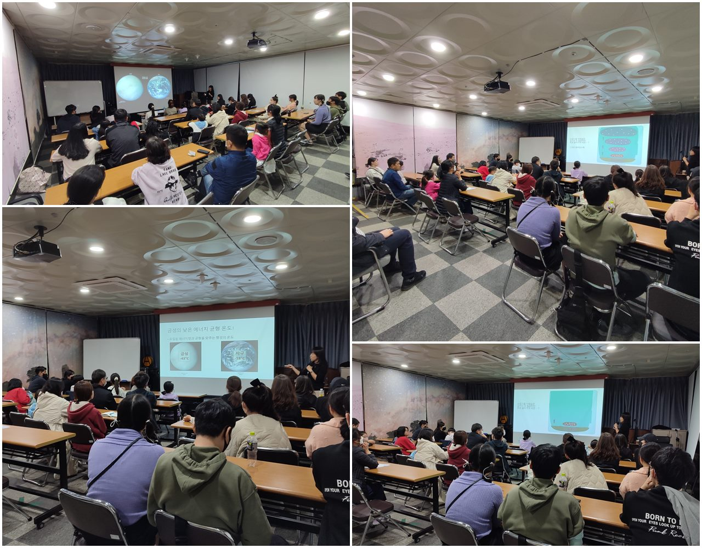

PAG has collaborated with the staff at the Daejeon Civil Observatory for public outreach activities.

On 30th April, we hosted our first outreach activity at the Daejeon Civil Observatory, with Dr. Yeon Joo Lee as the keynote speaker. Her presentation was in Korean and about clouds on Earth and Venus.

Thanks to all participants and the team at the observatory. The observatory generously provided quiz awards for the young attendees.

