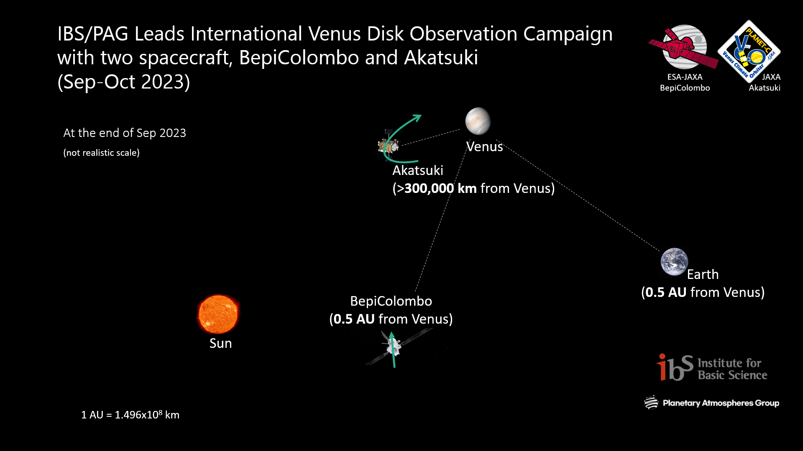

Planetary Atmospheres Group (PAG) thanks our international collaborators for joining the 2023 campaign. BepiColombo's PHEBUS took the faraway Venus data, and Akatsuki's UVI continuously monitored Venus. In total ten instruments from the ground joined the campaign: Bohyeonsan's 4kCCD, BOES and SPECTR spectrometers, Seoul National University's CCD imager (SAO), Calar Alto observatory 1.23 DLR-CCD imager, STELLA imager, Chungbuk National University observatory's CCD imager, Nayoro observatory's polarization imager, Ussuriysk Astrophysical Observatory's polarization imager. The PAG team communicates with the collaborators and gathers the data for further evaluation.
The set of Venus disk data that spans the time from September to November 2023 will help us to characterize the cloud top-level atmosphere of Venus in 2023. We do plan future coordination with spacecraft to make cross-check short and long-wavelength observations and diverse retrieval methods of observations

