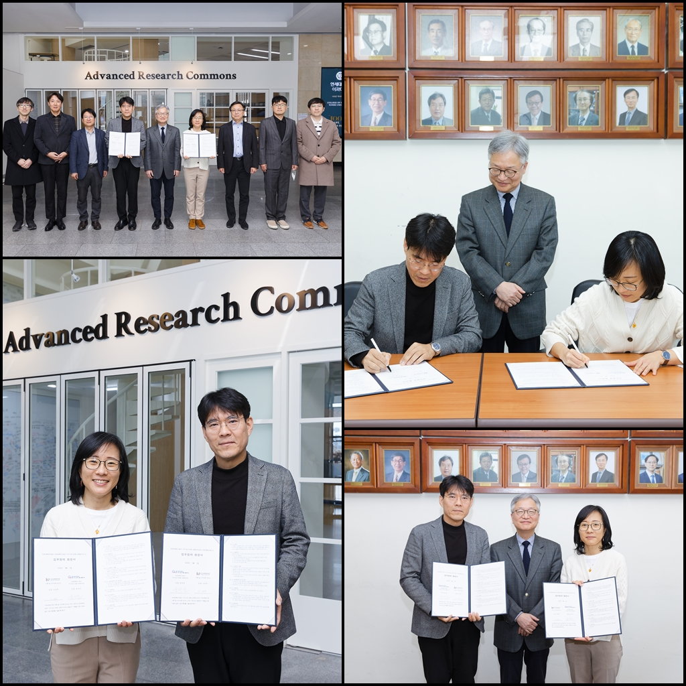

PRC for Climate and Earth Science made MoU with the BK21 Four Institute of Earth, Atmosphere, Astronomy at Yonsei Univserity. The MoU aims at establishing research collaboration, broadening international research network, and providing education opportunities. The MoU is valid for the coming 4 years, and extendable.

