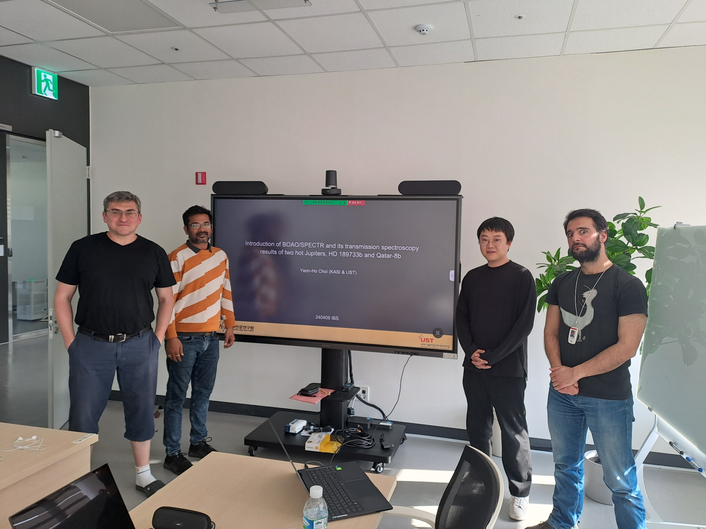

A PhD candidate Yeonho Choi (KASI, UST) visited PAG and introduced his ongoing research.

Title: Introduction of BOAO/SPECTR and its transmission spectroscopy results of two hot Jupiters, HD 189733b and Qatar-8b

