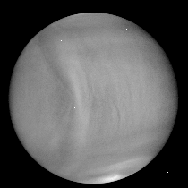

PAG plans its fourth Data Workshop. This workshop will explain images at 10 µm of Venus (see the sample image above), which provides atmospheric temperature information, ~65 km above the surface. The Longwave Infrared Camera (LIR) acquired the sample image from the Akatsuki Venus orbiter, operating since 2015. The global-scale atmospheric wave is clearly visible on the Venus disk's left half (note that Venus's radius is 6,052 km). The source of the wave is the high mountains on the surface (1-5 km elevation), implying the important surface influence on the planet's atmosphere.

The goals of PAG’s Data Workshops are
(1) lowering a barrier for researchers to access recent Venus data
(2) providing opportunities for internships (either undergraduate or graduate school students) to join PAG during the summer vacation and beyond.
*Note for the internship notification.

### How to attend the workshop
Date and Time: May 17th (Fri) 16:00-18:00 KST
Zoom registration: https://zoom.us/meeting/register/tJ0scOiqqzMiE9HPHIrJ4j20WiZrcsqFfLDf

### What you need
Your camera, speaker, and microphone for online communication.
Jupyter Notebook

### Agenda
1. Akatsuki orbiter and its image acquisition (50 min)
2. Handling sample Akatsuki/LIR images: Understanding the structure of the data and simple image process (50 min)
3. Announcement: PAG’s Summer Internship opportunity (2 topics) & Job opening