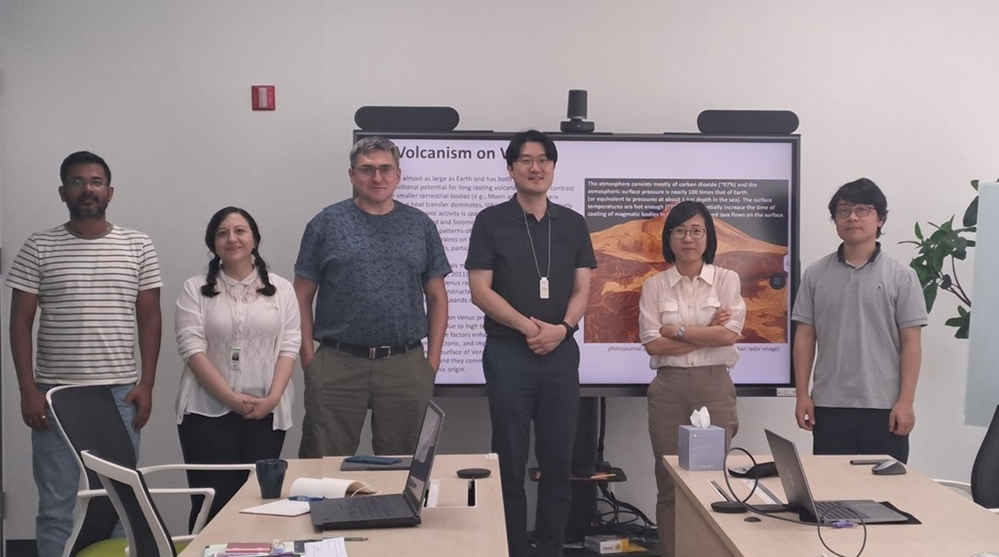

Prof. Hyunwoo Lee (Seoul National University) visited PAG and introduced his ongoing research.

Title: Extraterrestrial Volcanism, Volcanism in the Inner Solar System

Prof. Lee analyzed evidence of features in the surface morphology of Venus, Mars, Mercury, the Moon and some icy
satellites of the outer solar system, which can be interpreted as a possible indication of volcanic activity similar to that found in different places on Earth.

